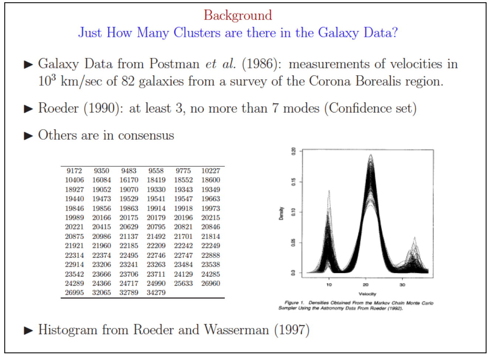
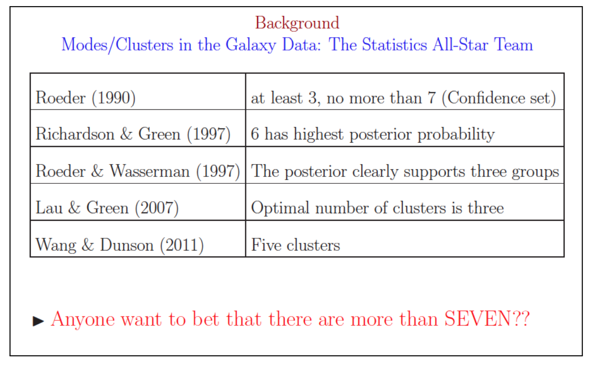
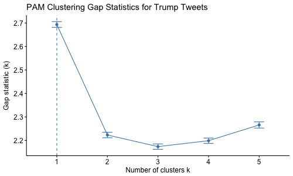

*Some parts of this lab are inspired by Ryan Tibshirani's course Data Mining at Carnegie Mellon University*

Choosing the Optimal Number of Clusters
================================
In most exploratory applications, the number of clusters $K$ is *unknown*. Determining the number of clusters is a very difficult problem. We can not visually determine the number of clusters unless the data are low-dimensional. It's also hard to quantify exactly what makes a cluster and why one clustering scheme is better than another. 

The number of clusters is highly dependent on which clustering method you choose and how you decide to choose the correct number of clusters. *There is no 100% correct answer*.


Galaxy Clusters Example
----------------
(George Cassella 2011)
Looking at a single patch of the sky, it is difficult to determine which galaxies are part of the same cluster and which are not. Astronomers use the relative galaxy velocity to create clusters from the observations. It would be useful to know exactly how many galaxy clusters wer are looking for in our patch of sky. 

The result: over 10 years of trying to determine the number of exact clusters and many different answers.





Methods to Choose the Optimal Number of Clusters
============================

Here we will go through the methods that Mark mentioned in class. Let's revisit our civil war dataset:
```{r}
#install.packages('cluster.datasests')
library(cluster.datasets)
library(ggfortify)

# Load Data
data(us.civil.war.battles)
?us.civil.war.battles

# Seperate the names for later
civilWar<-us.civil.war.battles[,-1]
rownames(civilWar)<-us.civil.war.battles[,1]


# Plot PCs
cw.pca<-prcomp(civilWar,scale=F,center=F)

autoplot(cw.pca)+
  geom_density2d()+
  ggtitle('First 2 PCs of Civil War Data')


```

Elbow Plot
---------------

The elbow method looks at the within-cluster sum of squared distances between all pairs of cluster $k$. Note that the within cluster sum of squared distances decreases when we increase $k$. Instead of looking for an extrema, we look for an elbow in the plot.

```{r}
library(NbClust)
library(factoextra)

fviz_nbclust(civilWar,kmeans,method='wss')+
  ggtitle('K-means clustering for Civil War Data')

```

Based on the elbow plot, we decide to divide the civil war data into 2 clusters, though 5 also looks like a possible split.

Average Silhouette
--------------
The silhouette measures the difference between the dissimilarity between observation $i$ and other points in the next clostest cluster and other points in the cluster in which $i$ belongs to. Here we look at the average silhouette statistic across clusters. It is intuitive that we want to *maximize* this value. 

```{r}
fviz_nbclust(civilWar,kmeans,method='silhouette')+
  ggtitle('K-means clustering for Civil War Data - Silhouette Method')
```
Again we see that the optimal number of clusters is 2 according to this method. 

Gap Statistic
-----------

When the Gap method chooses 1 cluster as optimal, there is  insufficient evidence to suggest that any clusters exist. 

```{r}
library(cluster)
set.seed(333)

cw.gap<-clusGap(civilWar,FUN=kmeans,K.max=10,B=500,d.power=2)
fviz_gap_stat(cw.gap,
              maxSE=list(method='Tibs2001SEmax',SE.factor=1))
  
```
The optimal number of clusters determined by the Gap statistic is 2. 


Aggregate
--------

Since there is no best way of choosing the number of clusters, we can aggregate over all of them and see which is most commonly chosen.

```{r}
cw.agg<-NbClust(scale(civilWar),method='kmeans',index='alllong')
#Data needs to be scaled for some methods
fviz_nbclust(cw.agg) + theme_minimal()
```

Most of the methods choose 2. Let's re-fit our k-means so that $k=2$.

```{r}
cw.kmeans<-kmeans(civilWar,2)
fviz_cluster(cw.kmeans,data=civilWar)
```

Bayesian Inference Criterion Using `Mclust`
-----------

The `Mclust` function determines the optimal number of clusterst according to the Bayesian Inference Criterion (BIC):

$$ \mbox{BIC} = \ln (n) \omega -2 \ln (\hat L) $$
Where $\hat L$ is the maximized likelihood function and $\omega$ is the number of parameters estimated in the model. Typically, we want to minimized this criterion. Th function `Mclust` does this for you if you specify multiple clusters (default is 1 through 9):
```{r}
library(mclust)
cw.mclust<-Mclust(civilWar)
cw.mclust$G
fviz_cluster(cw.mclust,frame.type='norm',geom='point')
```

Checking Your Clusters
========================

* Clusters are well dispersed. i.e. you don't want all ponts but one or two to be in a single cluster as this is an indication that your method is too sensative to outliers or that no cluster actually exists. 
* Silhouette plot quantifies whether an observation is correctly assigned to a clsuter or not.

* $s \approx 1$ - well clustered
* $s \approx 0$ - lie between two clusters
* $s<0$ - probably in the wrong cluster

```{r}
fviz_silhouette(silhouette(cw.kmeans$cluster,dist=daisy(civilWar,metric='euclidean')),main='Silhouette plot for Kmeans Clustering')
```
It appears that most of the observations in cluster 2 are a good fit. Many observations in cluster 1 closely resemble those in cluster 2. None appear to be incorrectly assigned to a cluster. 


Your Turn: Find the Optimal Number of Clusters for Trump Tweets
========================
Last time we assumed that there were only two clusters, yet there was visual evidence to suggest that there may be more than 2 clusters. We will use the numerical data to explore the optimal number of clusters for k-medoids clustering. Just like the galaxy example, the clustering method will dictate the optimal number clusters.

First lets load the data from last time. I gave it to you pre-formatted. 
```{r}
load('trumpTweet_2017.Rdata')
# Var name 'tweets'

cl.vars <- c("retweet_count","favorite_count", "source", "day", "weekday", "time", "hashes", "mentions", "link")
num.vars <- c("retweet_count", "favorite_count", "day", "weekday",
              "time", "hashes", "mentions")
```

For the parts below use only the numerical data to create clusters via PAM using a manhattan distance metric.
```{r}
tweet.num<-tweets[num.vars]
```
1.  Using the elbow method, what is the optimal number of clusters?
```{r}
fviz_nbclust(scale(tweet.num),pam,method='wss',metric='manhattan')+
  ggtitle('PAM clustering for Trump Tweets')
```
The elbow appears to be at 5 clusters. 

2.  Using the silhouette method, what is the optimal number of clusters?

```{r}
fviz_nbclust(scale(tweet.num),pam,method='silhouette',metric='manhattan')+
  ggtitle('PAM clustering for Trump Tweets')
```
The optimal number of clusters using the sillhouette method is three.

3.  Interpret the graph created via the gap statistic method. What is the optimal number of clusters?


We must set **d.power=2** in the function `clusGap()` and **method='Tibs2001SEmax'** in the function `fviz_gap_stat()` to use the same GAP method mark used in class.

```{r}
#gapstat.pam=clusGap(scale(tweet.num),FUN=pam,K.max=10,d.power=2,B=500,metric='manhattan')

#png('gapTrump_num.png',width=500,height=300)
#fviz_gap_stat(gapstat.pam,
#              maxSE=list(method='Tibs2001SEmax',SE.factor=1))+
#  ggtitle('PAM Clustering Gap Statistics for Trump Tweets')
# dev.off()
```
4.  Use the `NbClust` function in the `NbClust`  library to aggregate results across all the clustering functions? (Hint: use index='all' or 'alllong')

```{r}
# Normally we would use 'all' or 'alllong' for the index, but there is a bug in one of the methods so we cannot run all of them. Run all the models in the inds vector below.
# This takes a few minutes to run.
inds <- c("kl", "ch", "hartigan", "ccc", "scott", "marriot", "trcovw", "tracew", "friedman", "rubin", "cindex", "db", "silhouette", "duda", "pseudot2", "ratkowsky", "ball", "ptbiserial", "mcclain", "dunn", "hubert", "sdindex", "dindex", "sdbw")
inds.k<-c()
for(ii in inds){
  tweets.nbc<-NbClust(data=scale(tweet.num), 
                    distance='manhattan',
                    min.nc=1, max.nc=10,
                    method='centroid',index=ii)
    
    cat("index = ", ii, ":\n")
    cat("index values:\n")
    print(tweets.nbc$All.index)
    cat("best cluster number:\n")
    print(tweets.nbc$Best.nc)
    
    inds.k<-c(inds.k,tweets.nbc$Best.nc[1])
}

ggplot(data.frame(k=inds.k),aes(x=k))+
  geom_bar()

```
The majority of these clustering algorithms chooose only 2 clusters. 

5.  Based on the results from above, what is the optimal number of clusters for K-mediods clustering? Run k-medoids clustering using the optimal number of clusters $K$ and visualized your results.

It is tough to decide the number of clusters here. There is no correct solution here, but this is how I would think about it. 

Elbow method and the average silhouette method choose 5 and 3 clusters as optimal, respectively. The GAP statistics method shows no significant evidence that a cluster even exists. Since these methods give such a wide variety of results, we choose to run all known methods and choose the number of clusters most frequently chosen. By doing this, we choose 2 clusters as optimal. 

```{r}
tweet.pam<-pam(tweet.num,stand=T, metric='manhattan',k=2)
fviz_cluster(tweet.pam,data=scale(tweet.num))
```
6. Use a silhouette plot to determine if any observations were missclustered.

```{r}
fviz_silhouette(silhouette(tweet.pam$cluster,dist=daisy(tweet.num,metric='manhattan')),main='Silhouette plot for PAM Clustering')

```

For the most part, cluster one appears to be a good fit with the exception of a few that are possibly in the wrong cluster. Cluster two have most observations close to zero and about a quarter with negative values, indicating that many of the observations were miss-classified. We should consider the possibility that there may be more clusters that contain those that are poor fits for these clusters, or that no clusters exist. 

(Advanced aka if you have time) For the parts below use the numerical and categorical data to create clusters via Agglomerative clustering with the "ward" method. 

Here is what agg. clustering gives with two clusters:
```{r}
library(cluster)
library(ggplot2)
tweet.cat<-tweets[cl.vars]
tweets.dist.cat <- daisy(tweet.cat,
                     metric = "gower",stand=T)
tweets.mds <- data.frame(tweet.cat,cmdscale(tweets.dist.cat))

tweet.agnes<-agnes(tweets.dist.cat,diss=T,method='ward')
grp.agnes<-cutree(tweet.agnes,k=2)
tweet.agnes.df<-data.frame(tweets.mds,cluster=factor(grp.agnes))
ggplot(tweet.agnes.df,
       mapping = aes(x = X1,
                     y = X2,col=cluster)) +
    geom_point()
```

Note that using categorical factors limit the methods we are able to use to determine the optimal number of clusters. Out of the Elbow, Average Silhouette, and Gap Statistics methods we are only able to apply Average Silhouette.

7.  Using the silhouette method, what is the optimal number of clusters?

```{r}
library(factoextra)
library(NbClust)

sil.clust<-NbClust(diss=tweets.dist.cat, 
                    data=NULL,distance=NULL,
                    min.nc=2, max.nc=8,
                    method='ward.D',index='silhouette')
ggplot(data.frame(avgSil=sil.clust$All.index,index=2:8),aes(y=avgSil,x=index))+
  geom_point()+
  geom_line()+
  geom_vline(xintercept=4,col='red')+
  ggtitle('Aggl. Clustering- Silhouete Method')

```

8. Use the `NbClust` function in the `NbClust`  library to aggregate results across all the clustering functions? Using the `NbClust` function with only a distance matrix we are able to use a subset of the indexes: `frey`,`mcclain`,`cindex`,`silhouette`, and `dunn`. 

```{r}
inds <- c("frey", "mcclain", "cindex", "silhouette", "dunn")
inds.k<-c()
for(ii in inds){
  tweets.nbc<-NbClust(diss=tweets.dist.cat, 
                    data=NULL,distance=NULL,
                    min.nc=2, max.nc=8,
                    method='ward.D',index=ii)
    
    cat("index = ", ii, ":\n")
    cat("index values:\n")
    print(tweets.nbc$All.index)
    cat("best cluster number:\n")
    print(tweets.nbc$Best.nc)
    
    inds.k<-c(inds.k,tweets.nbc$Best.nc[1])
}

ggplot(data.frame(k=inds.k),aes(x=k))+
  geom_bar()

```
Two of the five methods suggest that there are 4 clusters. 

9. Based on the results from above, what is the optimal number of clusters for K-mediods clustering? Run k-medoids clustering using the optimal number of clusters $K$ and visualized your results.

```{r}
grp.agnes<-cutree(tweet.agnes,k=4)
tweet.agnes.df<-data.frame(tweets.mds,cluster=factor(grp.agnes))
ggplot(tweet.agnes.df,
       mapping = aes(x = X1,
                     y = X2,col=cluster)) +
    geom_point()
```


Density-Based Clustering Aglorithm
=================
Applied in R using the `dbscan` function. Mark highlighted some huge advantages using this algorithm in class. 

In order to estimate $\epsilon$ use `kNNdistplot` in the `dbscan` package.
```{r}
library(dbscan)
kNNdistplot(scale(tweet.num),k=2)
abline(h=2.2,lwd=2,col='red',lty=3)
abline(h=1.2,lwd=2,col='red',lty=3)
```

Next we implement `dbscan` using the epsilon determined above:
```{r}
tweet.db<-dbscan(scale(tweet.num),eps=2)
fviz_cluster(tweet.db,data=scale(tweet.num),geom='point')

table(tweet.db$cluster)
```

Your Turn: Explore DBScan
========================

1. Create an average silhouette plot using your DB Scan results. 

```{r}
fviz_silhouette(silhouette(tweet.db$cluster[tweet.db$cluster!=0],dist=daisy(tweet.num[tweet.db$cluster!=0,],metric='euclidean')),main='Silhouette plot for DBScan Clustering')
```

2. Do you think this data set is a good fit for Density Based Clustering? Why or why not?

Probably not. There is no evidence that the clusters are irregularly shaped. The average silhouette plot shows that many of the points are assigned to an incorrect cluster. 


Lab Survey
=============================

Please fill this out at the end of lab each week. This will be anonymous and will NOT be used for attendance. At the end you will have the opporutnity to leave any unanswered questions. If enough people ask the same question I will post an answer in supplementary material. 

https://goo.gl/forms/SxS1HsnJdZFbh5n52
