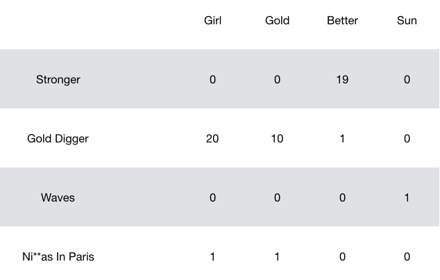
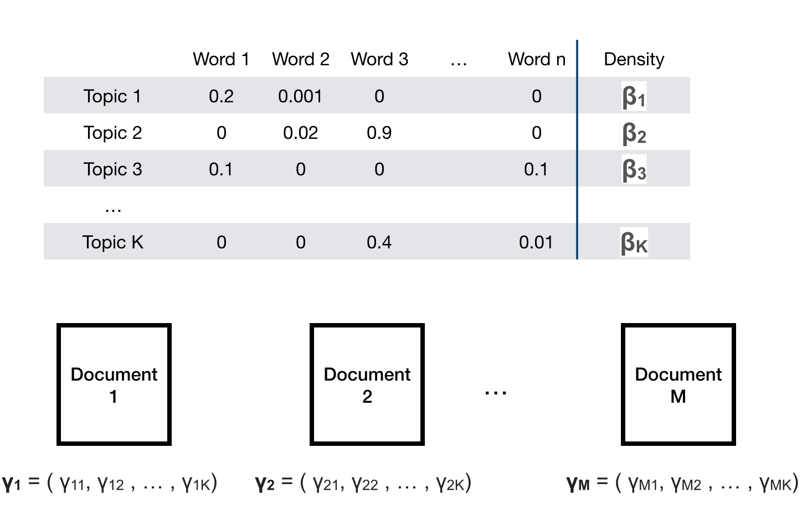

Format Dataset
=============================

Kanye West (if you haven't heard of him) is one of the greatsest rappers/ hip-hop artists/ producer. He has released 9 albums since 2004 all with very styles and sounds. If you are unfamiliar with his discography you can check out a short synopsis of each album here:

http://read.tidal.com/article/kanye-west-album-by-album

For this lab we will explore to see what topics Kanye explores in his lyrics and if these themes change across albums.

Kaggle has a .csv file that contains the album title, the song title and the lyrics of the entire discography of Kanye. 
```{r}
kanye<-read.csv('kanye_west_discography.csv')

#Lyrics need to be of type character
kanye$lyric<-sapply(kanye$lyric,as.character)

#Split by album, this will become clearer later
kanye.album<-split(kanye,kanye$album)
unique(kanye$album)
```

The first part of this lab, we will learn how to manipulate the lyrics into a Document Term Matrix (DTM). A DTM is a sparse matrix which contains counts of each words in the entire dicitionary (columns) in each document (rows.) Once we have the lyrics in the form of a DTM, the LDA will be very easy. Here is an example of what a DTM might look like:




First thing we will do is load the relevant libraries for text formatting and LDA. 
```{r loadLib}
library(topicmodels) #topic modeling functions
library(stringr) #common string functions
library(tidytext) #tidy text analysis
suppressMessages(library(tidyverse)) #data manipulation and visualization
library(scales) #used for percent scale on confusion table

## Source topicmodels2LDAvis & optimal_k functions
invisible(lapply(
file.path(
"https://raw.githubusercontent.com/trinker/topicmodels_learning/master/functions", 
c("topicmodels2LDAvis.R", "optimal_k.R")
),
devtools::source_url
))

```

Chaining Functions
----------------

In Mark's lecture notes and in the code below, you will notice we use the strange string of characters \%\>\%. We loaded into R via the `dplyr` package and is originally part of the `magrittr` package. It is used to chain funcitons together that would otherwise be nested. In some cases it is easier to read than nesting many functions. A simple example is that the following two expressions are equivalent:
```{r}
head(sort(kanye$song),10)
kanye$song%>%sort%>%head(10)
```

We will also use a new type of class called a `tibble` which is a trimmed down data frame. It is essentially the same, just stored in a different manner and the package comes with very convenient functions for manipulation. Check out the help page for more information.

Here we will use the chaining technique to group the individual songs into albums. This step is not neccesary for every dataset.
```{r}
album_names<-names(kanye.album)
by_song<-c()
for(ii in 1:length(kanye.album)){
  album<-rowid_to_column(tibble(text=kanye.album[[ii]]$lyric,
                                title=album_names[ii]),var='song')
  by_song<-rbind(by_song,album)
}

by_song<-by_song %>% 
  unite(document,c('title','song'),sep="_",remove=T)

by_song
```


Word Counts
-------------

To create a DTM we will need the word counts for each song, or document. The function `unnest_tokens` seperates the lyrics for each song into individual words. The function `count` will aggregate the counts of each word within each document. 
```{r}
by_song_word <- by_song %>%
  unnest_tokens(word, text)

# find document-word counts
word_counts <- by_song_word %>%
  anti_join(stop_words) %>%
  count(document, word, sort = TRUE) %>%
  ungroup()
```

Stop Words
----------
Notice above we filtered out stop words using the `anti_join` function. Stop words are words filtered out before processing. These contain words such as "a", "the" or "and" that are used ubiquitously and do not hold much valuable information. The variable `stop_words` is automatically loaded via the `tidytext` package, but we are able to add or remove words from this data frame to filter out more or less than those already included.
```{r}
# Add stop words

add_stop<-c("la","it’s","don’t","that’s","yeah","ya","uh","ye","ra","yo")
stop_words_add<-add_row(stop_words, 
word = add_stop)
stop_words_add<-stop_words_add[-which(stop_words_add[,1]=='me'),]

word_counts <- by_song_word %>%
  anti_join(stop_words_add) %>%
  count(document, word, sort = TRUE) %>%
  ungroup()

head(word_counts)
```

DTM
-----
Finally we can convert these word counts into a DTM using the `cast_dtm` function as shown below. 

```{r}

songs_dtm <- word_counts %>%
  cast_dtm(document, word, n)
```

Latent Dirichilet Analysis (LDA)
===============

Now that we have a DTM conducting the LDA will be very easy. 


Optimum Number of Topics
------
Just like clustering, the first step is to determine the optimal number of topics we have in our data. one way that is practiced is maximizing the harmonic mean of the log likelihood. This is done via the `opt.k` function shown below.

 
```{r}
control <- list(burnin = 500, iter = 1000, keep = 100, seed = 2500)
opt.k = optimal_k(songs_dtm, max.k=30, control=control,drop.seed = FALSE)
opt.k
```

Run LDA
------

We can run a LDA by simply using the function `LDA`. LDA simultaneously estimates the distribution of words in each topic $\beta$ and the distribution of topics in each document $\theta$. 



```{r lda}
song_lda = LDA(songs_dtm, k = as.numeric(opt.k), 
                   method="Gibbs", control=control)
```

Interpret LDA
------
Interpreting the LDA output is the most important part of the analysis and takes more care and time. 

First we will try go get an idea of what topics were created by printing the top 10 terms per topic. Do you see any patterns?
```{r}
#output top 10 terms per topic
lda_inf = posterior(song_lda)
topics.hp = topics(song_lda,1)
terms.hp = terms(song_lda, 10)
print(terms.hp[])
```

We might be interested in which words are "topic defining". We can do this by first finding the words with the highest probability given a topic. We can also visualize the distribution of the top few words within each topic vi bar graphs of the top $\beta$, the probability of a word occuring given a topic. 
```{r}
song_topics <- tidy(song_lda, matrix = "beta")
top_n(song_topics, 10)

top_terms <- song_topics %>%
  group_by(topic) %>%
  top_n(10, beta) %>%
  ungroup() %>%
  arrange(topic, -beta)

top_terms %>%
  mutate(term = reorder(term, beta)) %>%
  ggplot(aes(term, beta, fill = factor(topic))) +
  geom_col(show.legend = FALSE) +
  facet_wrap(~ topic, scales = "free") +
  coord_flip()
```


Similarly, we can also explore which topics dominate in which documents. First we can look at the topics with the highest $\gamma$,  the probability density of the topic given the song. Since our songs can also be grouped into albums, we can look at the distribution of topics within an ablum. Note that this cannot be done with every text data set, but is a great thing to do when applicable. 


```{r}
song_gamma <- tidy(song_lda, matrix = "gamma")

song_gamma <- song_gamma %>%
  separate(document, c("title", "song"), sep = "_", convert = TRUE)

top_n(song_gamma, 20)


song_gamma %>%
  mutate(title = reorder(title, gamma * topic)) %>%
  ggplot(aes(factor(topic), gamma,fill=factor(topic))) +
  geom_boxplot() +
  facet_wrap(~ title)+
  scale_y_sqrt()


```

Your Turn: Remove Explitives
=============================

Unsurpriselingly, Kanye's language is filled with explitives. Imagine you're presenting your work in an interview (or maybe a class..) and feel uncomfortable including the swear words. Re-run the LDA  analysis we just did above and interpret your results. Are there any differences in topics than before?

You can get a list of swear words here (you may also had to add a few more on your own):

http://www.bannedwordlist.com/lists/swearWords.txt

Solution
----------
First we need to add swears to the stop words data frame.
```{r, eval=F}

# load swear words
#download.file('http://www.bannedwordlist.com/lists/swearWords.txt','swears.txt')
swears<-as.character(read.table('swears.txt')$V1)
# add some more

# add all swears to stop words

# remove stop words from word_counts

```

Then we can creat the DTM again:
```{r}

```

And optimize the number of topics:
```{r}

```

Finally, we perform LDA with the optimal number of clusters:
```{r}

```

Let's take a look at the topics. It seems like some themes are becoming visable. Some examples:

* Topic 1 talks about friends, love and got, but also contrasts it with themes of winter and cold.

* Topic 4 brings up words associated with a night life.

* Topic 10 seems to bring up words potentially associated with his career. 
```{r}
#output top 10 terms per topic

```

Find the top words in each of the topics as well as visualize some of the beta values for words in each of the topics, as done before
```{r}

```

Find the top topics per document (song). Create a similar lattice of barcharts as before. Do you see any patterns? Is it different than the LDA without the swear words?
```{r}

```


Lab Survey
=============================

Please fill this out at the end of lab each week. This will be anonymous and will NOT be used for attendance. At the end you will have the opporutnity to leave any unanswered questions. If enough people ask the same question I will post an answer in supplementary material. 

https://goo.gl/forms/WPfF0XO9i0IXuOWi2